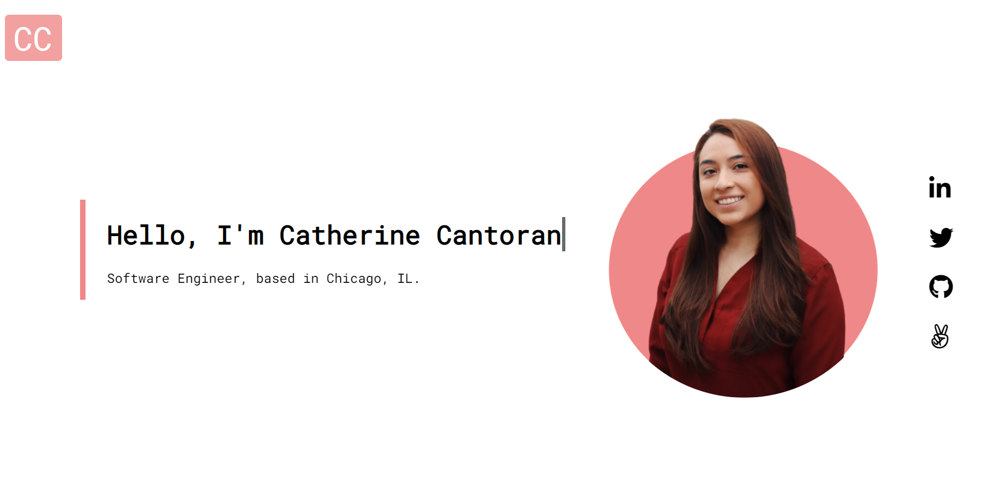

# My Website READ ME
This project was to create a centralized page where future clients and employers can find and see my portfolio. 

Check out the live site!

https://catherinecantoran.com/

# How it was made
Tech that was used was primarily HTML & CSS with some Javascript sprinkled on. 

I wanted to make a website for everyone to find me. I recently went to a tech conference and I realized I needed a page to highlight my project. Meeting new people and scrolling to find my projects was not seamless and I needed a seamless solution. I built my website from start to finish and I had a great time. I  learned a lot and really polished my skills. I learned how to make a different kinds of navigation bars, a couple CSS animations, and other skills that were hard to learn but I enjoyed every second. I’m really happy with how it turned out. I originally wanted to collaborate with a UX designer but I decided to just wing it and see if I could make it look great. It turned out better than I expected. Im really excited to show this at my next conference and really excited to show potential clients. Overall super happy with the results and can't wait to get started on my next website and/or project!

# Optimizations
I would change a couple padding properties in the navigation bar. A small detail but it bothers me😩

I would also make the thumbnails of my projects have some effect, either hover effect or play-on-scroll. I definitely want to make this change and as soon as I have a couple hours of free time. 

# Lessons learned
I learned a lot of stylistic things such as CSS animations and transitions. I’m really happy that I got a project that I could really solidify these concepts. I feel really comfortable now in this area whereas before I was very intimidated! I included a QR code and favicon just as a small detail. 
